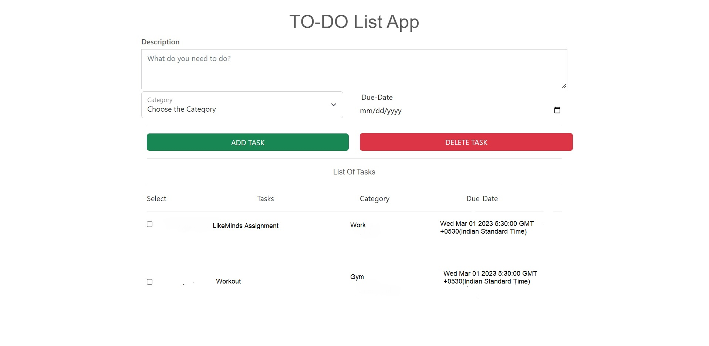

# ToDoList

## Problem Statement:
Garry wants to create a to-do app where users can manage their daily tasks. Garry wants to use some APIs to power his app. Design an API product that Garry can use to do the following:
- Show a list of tasks.
- Create, edit and delete tasks.
- Mark a task "done".
- Set reminders for the tasks.

<p>
    
</p>
<br>

## How to use
```npm install express```

```npm install ejs```

```npm install body-parser```

```npm install mongoose```

```npm install -g nodemon```

```nodemon app.js```

### Steps to perform tasks:
1.Enter the task in description box

2.Enter the category

3.Enter the due date

4.We can apply CRUD operations


## APIs developed

### Rendering the App Page
```
app.get('/', function(req, res){
    Task.find({}, function(err, task){
        if(err){
            console.log('Error in fetching tasks from db');
            return;
        }

        return res.render('home', {
            title: "TODO_List",
            task: task
        });
    }
)});
```

### Creating tasks
```
app.post('/create-task', function(req, res){
  //  console.log("Creating Task");
    
    Task.create({
        description: req.body.description,
        category: req.body.category,
        date: req.body.date
        }, function(err, newtask){
        if(err){console.log('error in creating task', err); return;}
        

        //console.log(newtask);
        return res.redirect('back');

    });
});
```

### Deleting tasks
```
app.get('/delete-task', function(req, res){
    // get the id from query
    var id = req.query;

    // checking the number of tasks selected to delete
    var count = Object.keys(id).length;
    for(let i=0; i < count ; i++){
        
        // finding and deleting tasks from the DB one by one using id
        Task.findByIdAndDelete(Object.keys(id)[i], function(err){
        if(err){
            console.log('error in deleting task');
            }
        })
    }
    return res.redirect('back'); 
});
```
## Overview
The Todo List API allows users to manage their to-do lists. This API supports basic CRUD operations (Create, Read, Update, Delete) on a to-do list item.

Authentication
All endpoints require authentication using an API key.

## Endpoints

### GET /tasks
Returns a list of all tasks.

Parameters
None

#### Response
`{    "id": 1,
"name": "task",
"category":"category of the task",
"due_date": "2023-03-10T12:00:00.000Z", 
"  }`

### POST /tasks
Adds a new task to the list.

Parameters

name (required) - name of the task (string)
category (optional) - description of the task (string)
due_date (optional) - due date of the task (date in ISO 8601 format with GMT and time and date)

#### Response
`{    "id": 1,
"name": "task",
"category":"category of the task",
"due_date": "2023-03-10T12:00:00.000Z", 
"  }`

### GET /tasks/:id
Returns a specific task.

Parameters

id (required) - ID of the task (integer)

#### Response
`{    "id": 1,
"name": "task",
"category":"category of the task",
"due_date": "2023-03-10T12:00:00.000Z", 
"  }`

### PUT /tasks/:id
Updates a specific task.

Parameters

id (required) - ID of the task (integer)

#### Response
`{    "id": 1}`
